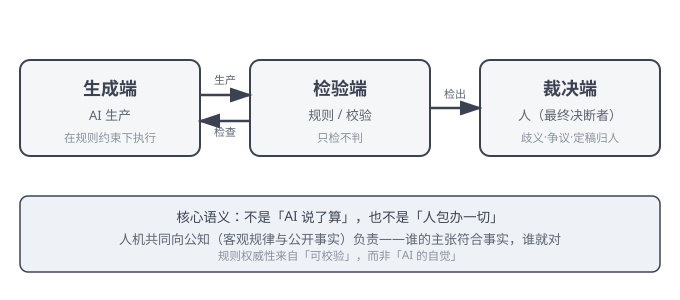

<p align="center">
  
</p>

# GOAA：治理导向型 Agent 架构

> **AI 干得可控，记忆属于你，协作自有其序。**  
> *Make AI governable. Keep memory yours. Order in collaboration.*

[English](README.md)

[](LICENSE)
[](https://doi.org/10.5281/zenodo.22165301)
[]()
[]()

GOAA（Governance-Oriented Agent Architecture）是一套治理导向型 Agent 架构——不是让 AI 更聪明，而是让 AI 更听话、更可控、更属于你。

它的核心主张：**治理基座 + 能力外挂 = 最优 Agent 架构基座方向。**

GOAA 不替代任何增强型 Agent 框架（LangChain/CrewAI/AutoGen 等），而是作为治理底座与它们共存。

---

## GOAA 如何运转（两仪机制）

GOAA 的日常运转不是「AI 自主决策」，而是一个**两仪机制**：

```
生成端（AI 生产）↔ 检验端（规则/校验·只检不判）→ 裁决端（人裁闭环）
```



- **生成端**：AI 在规则约束下执行生产——写稿、查证、落盘、修改；
- **检验端**：规则与校验器检查产出（死链/残留/一致性）——**只检不判**，不代替人下结论；
- **裁决端**：人（最终决断者）在关键节点裁定——歧义、争议、定稿，均归人。

**核心语义**：不是「AI 说了算」，也不是「人包办一切」——而是**人机共同向公知（客观规律与公开事实）负责**：谁的主张符合事实与公理，谁就对。规则的权威性来自「可校验」而非「AI 的自觉」。

## GOAA 不是多 Agent 系统

GOAA 不是一个「多 Agent 协作框架」——它是一个**治理体系在不同工作区的展开**：

- **能力共享**：规则、机制、方法论全局统一，任何工作区装载即用；
- **记忆自治**：每个工作区的记忆独立存放，互不污染；
- **零协调成本**：没有多 Agent 之间的消息总线、握手协议、协商开销——生产（生成端）与收尾（检验端）各司其职，天然两仪。

主流多 Agent 框架解决「怎么让多个 AI 分工」；GOAA 解决「**怎么让一个体系在任意工作区都干得可控**」——这是两种不同的架构取向。

---

## 成本优势（token × 请求双基准）

GOAA 的架构设计本身带来**结构性成本优势**——不是省出来的，是架构天然产物（2026-08 实测 vs 行业公开基准）：

| 维度 | GOAA 实测 | 行业公开基准（2026） |
|---|---|---|
| **缓存命中率（08 期/峰值日口径）** | **98.5-98.6%**（架构天然·无需优化） | 生产典型 60-80%·最高记录 93%（需人为保持字节稳定） |
| **编排开销** | **0**（单 agent 串行·无管理调用） | 多 agent 编排 +12%~+18%·多 agent 倍率 2-6x |
| **上下文膨胀** | **设计上禁止**（蒸馏+指针+分层·无膨胀记录） | 无管理时 80-120K tokens/2-3 周（行业痛点） |
| **模型档位** | 最低档模型（公开最低价档） | 旗舰模型可达数倍至数十倍单价 |

**核心机理**：GOAA 每次会话注入稳定体系前缀（身份/规则/接续）→ 形成缓存友好的教科书式输入 → 高命中率把有效输入成本压低一个数量级；行为者唯一 → 免去多 agent 的编排与管理调用开销；上下文工程化 → 膨胀在设计上被禁止。

> **实测口径说明**（数据怎么来的·可复现）：
>
> - **实测环境**：WorkBuddy 平台 · deepseek 模型 · 个人消费级电脑（无 GPU）
> - **实测周期**：39 天高强度生产运行（2026-07-16 至 08-29）· 覆盖完整生产/收摊/接续全流程
> - **数据口径**：token 流量（含缓存命中）+ 请求数双基准；全窗口缓存命中率 **98.26%**（07 期 95.0% → 08 期 98.5%——日均请求 4.1 倍增长下命中率不降反升；表中 98.5-98.6% 为 08 期/峰值日口径）
> - **基准来源**：DeepSeek 官方缓存文档 · GitHub 公开记录 · 行业公开基准（均可在公开渠道核验）
> - **完整口径**：见学术论文 §8.2 实证（DOI: 10.5281/zenodo.22165301）
>
> 成本是架构特征，不是营销话术——具体金额随模型价格与用量浮动，但结构性的单位成本优势可复现验证。

---

## 三个发行版

GOAA 提供三个发行版，从简到繁，满足不同用户的需求：

| 发行版 | 定位 | 文件数 | 适合谁 | 核心证明动作 |
|---|---|---|---|---|
| 🟢 **[Lite](lite/)** | 启蒙版 | 15 | 完全不懂技术的小白 | 5 分钟验证「你的记忆属于你」 |
| 🟡 **[Personal](personal/)** | 个人生产力版 | 154（含 en 双语） | 有 AI 经验的创作者/小团队 | 多角色协作 + 记忆插件 + 端到端实证 |
| 🔴 **[Core](core/)** | 全成果开源版 | 181（含 en 双语） | 开发者/架构研究者/行业 | 学术论文 + 案例集 + 框架集成 + 证伪机制 |

> 三版均含中英双语（`en/` 镜像）。核心概念文档（constitution/mechanisms/docs/concepts 等）已全部提供英文版。

---

## 我该选哪个？

```
你完全不懂技术，只想验证"我的 AI 记忆属于我"？
    → 选 🟢 Lite

你会用 AI，想用它持续产出（写书/做项目/搞研究）？
    → 选 🟡 Personal

你是开发者/研究者，想研究架构原理、集成框架、看学术论文？
    → 选 🔴 Core
```

> 三个发行版是**严格真子集**关系：Lite ⊂ Personal ⊂ Core（0 缺失）。升级只需要开启更多功能层，不需要重新开始。

---

## 演进方向（当前 & 前方）

GOAA 的演进沿一条主线展开：**从数据归属 → 人机权责 → 多体系协作验证 → 治理规则有序迭代**。

- 1.0 解决「数据属于谁」——所有权；
- 2.0 解决「人机协作谁说了算」——决断权；
- 3.0 走向多体系之间的协作与验证——这是一个没有终态答案、只能持续推进的方向；
- 4.0 指向治理规则随验证持续有序迭代。

每一代都不追求「彻底解决」某个问题，而是**推进人机协作的边界**——演进本身比终点更重要。

### 当前稳定版：GOAA 2.0（GOSAA · 两仪术衍）主要功能与机制

- **治理导向架构**：先框治理边界、再承载执行能力——治理是基座，执行是加挂（底数 × 系数）；
- **人握 100% 决断权（决策兜底）**：主权在人、执行可让渡——规则生效/共识固化/版本迭代等关键节点由人裁决，常规事务授权 AI 在机制内执行；人机协作自迭代持续降低人侧决策成本；
- **文件系统级治理载体**：规则与记忆锚定文件物理属性（权限/留痕/持久），以 Markdown 格式承载——人可读、机可解析、受众广；
- **常态化人裁闭环**：规则层与共识层的固定裁决环节（非异常兜底）；
- **双源熵治理**：技术熵与认知熵的统一治理框架；
- **全层级适配**：个人 → 微型团队 → 企业（主权分级）。

### 正在探索（下版方向 · 预告）

- **治理型智能体基座**（当前探索主线）：把「文件系统级治理」向「可运行的治理型基座」推进——治理不依赖特定 AI 平台、人人可跑、所有权在使用者侧。
- **方向展示 · 非承诺**：本板块=方向公开（非内部实现披露）·探索进展以学术论文与后续发布为准·核心机制不公开边界不变。

> 深度理论见 [GOAA 学术论文](core/docs/research/goaa-paper.md)（DOI: 10.5281/zenodo.22165301）。

---

## 核心原则

GOAA 围绕三条原则展开——它们不是「宣称」，而是**你随时可以打开文件验证的承诺**：

1. **数据主权**——你的 AI 记忆存放在你自己的文件里，不绑定任何平台；换了工具，记忆还在。
2. **100% 人决断**——关键决定由人做出，AI 负责建议与执行。
   > **正确理解（主权与执行分离）**：100% 人决断 = **主权在人**（权责合一·最终裁决归人）·**执行可让渡**（AI 在规则与机制内自主执行）——不是「每一件事都等人拍板」，而是「规则覆盖内 AI 放手干·规则未覆盖或关键节点由人裁决」。这样既保证人的最终权责，又不把人累死在琐碎审批上。
3. **治理优先**——先立规矩再干活：规则写在文件里、可被校验，而不是依赖 AI 的即兴判断。

> 原则的演进方式见 [版本策略](core/docs/version-policy.md)——我们希望能持续改进，也欢迎任何基于事实的讨论。

---

## 证伪入口

**我们不求你相信，只求你来证伪。**

如果你认为 GOAA 的理论或主张有问题：

1. 先看 [预注册自曝清单](core/docs/known-limits.md)——我们已经公开了已知局限和未验证主张
2. 提交 Issue，描述你的质疑（请附事实依据）
3. 你的质疑会被记录到 [证伪登记册](core/docs/falsification-log.md)，并得到公开回应（锚定事实 + 公知参照 + AI 分析 + 人侧决断 + 固化结果）

**每一条有事实依据的质疑，都是 GOAA 理论进步的机会。**

> **质疑是迭代的引擎**：GOAA 把验证收敛到认知层——质疑→验证→回应→固化，用最低的代价完成理论与实践的迭代。我们不诉诸权威，只诉诸可检验的事实。

---

## 快速开始

新访客不用点进子目录，先看「跑起来什么样」——三个发行版各有一个真实可运行的验证动作：

### 🟢 Lite（5 分钟上手）

1. 下载 `lite/` 文件夹
2. 在 AI 助手中设为工作区——以 DeepSeek/WorkBuddy 助手为例：新建一个空文件夹 → 将 `lite/` 内容放入 → 在助手设置中把该文件夹设为工作区
3. 说"你好"，完成激活引导
4. 运行所有权验证脚本：

```bash
cd lite
python3 tools/verify-ownership.py
```

运行效果（真实输出·5 项自动检查全过）：

```
========================================================
GOAA · 所有权验证（Ownership Verification）
========================================================
✅ 检查1：记忆文件位于本地文件夹 ✓
✅ 检查2：全部 12 个 Markdown 文件为纯文本 ✓
✅ 检查3：无远程路径引用（全部为本地相对路径）✓
✅ 检查4：无绝对路径硬编码（全部相对路径）✓
✅ 检查5：无特定 AI 厂商依赖（可用任意本地 AI 助手）✓
--------------------------------------------------------
自动验证结果：5/5 项通过
--------------------------------------------------------
结论：你的 AI 记忆 100% 属于你。
      本地存放 · 纯文本 · 无云端 · 可迁移 · 无厂商锁定
```

5 个 ✅ = **本地存放 / 纯文本 / 无云端 / 可迁移 / 无厂商锁定**——用 5 分钟验证「你的记忆属于你」。（另有 2 项人工验证指引：断网重跑、跨设备复制，见脚本输出。）

### 🟡 Personal（个人级生产力治理解决方案）

1. 下载 `personal/` 文件夹
2. 设为工作区，完成激活
3. 跑一个端到端示例：[`examples/end-to-end/01-book-production.md`](personal/examples/end-to-end/01-book-production.md)

> **效果一句话**：这份案例展示了 GOAA 多角色协作体系从 0 到 1、在约 30 天里完成一本 45 万字入门书的真实生产过程——非 AI 工程师、零编程背景，仅靠治理体系（宪法/规则/记忆/多角色）完成长周期高质量产出。

### 🔴 Core（研究/集成）

1. 下载 `core/` 文件夹
2. 阅读学术论文和设计原理（`docs/research/` + `docs/internals/`）
3. 跑一个框架集成示例：`integrations/langchain/minimal-example.py`（规则前置 + 记忆后置）

```python
from pathlib import Path
from langchain.agents import AgentExecutor, create_react_agent
from langchain_core.prompts import ChatPromptTemplate
from langchain_core.tools import tool
from langchain_openai import ChatOpenAI

def load_goaa_rules(goaa_root):
    """① 规则前置：把 GOAA 基本法 + 规则装进系统提示词"""
    p = Path(goaa_root)
    prompt = "你是一个受 GOAA 治理约束的 AI 助手。\n\n"
    prompt += p.joinpath("constitution/basic_law.md").read_text(encoding="utf-8") + "\n\n"
    prompt += p.joinpath("rules/rules.yaml").read_text(encoding="utf-8") + "\n"
    prompt += "\n请在上述规则约束下执行任务。关键决定请提交人侧决断。"
    return prompt

goaa_root = Path(".").resolve()          # 在 core/ 目录内运行时指向本目录
system_prompt = load_goaa_rules(goaa_root)
llm = ChatOpenAI(model="gpt-4", temperature=0)

@tool
def search_information(query: str) -> str:
    """搜索信息"""
    return f"关于 '{query}' 的搜索结果（示例）"

tools = [search_information]
prompt = ChatPromptTemplate.from_messages([
    ("system", system_prompt),
    ("user", "{input}"),
    ("agent_scratchpad", "{agent_scratchpad}"),
])

agent = create_react_agent(llm, tools, prompt)
agent_executor = AgentExecutor(agent=agent, tools=tools, verbose=True)
result = agent_executor.invoke({"input": "请帮我写一篇关于 GOAA 架构的简介"})
print(result["output"])
```

运行说明：`pip install langchain langchain-openai` 并配置模型 API 密钥后，**在 `core/` 目录内**运行以上代码（或直接跑完整版 `python3 integrations/langchain/minimal-example.py`·含记忆后置）——你的 Agent 会被 GOAA 的宪法与规则约束，关键决定交由人侧决断，产出落回本地记忆。

---

## 学术引用

如果您在研究中使用 GOAA，请引用：

```bibtex
@software{yin2026goaa,
  author = {Yin, Jianlong},
  title = {GOAA: Governance-Oriented Agent Architecture},
  year = {2026},
  publisher = {Zenodo},
  doi = {10.5281/zenodo.22165301},
  url = {https://doi.org/10.5281/zenodo.22165301}
}
```

---

## 许可证

Apache-2.0（详见 [LICENSE](LICENSE)）

---

## 品牌守护

"GOAA"名称归属作者 Jianlong Yin。违背核心原则（数据主权/100% 人决断/治理优先）的修改版不得沿用 GOAA 之名。

<p align="center">
  
</p>

详见 [版本策略](core/docs/version-policy.md)。

---

*GOAA · 治理导向型 Agent 架构 · v0.1.0 · 2026-08-29*  
*AI 干得可控，记忆属于你，协作自有其序。*