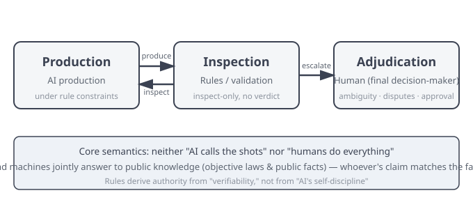

<p align="center">
  
</p>

# GOAA: Governance-Oriented Agent Architecture

> **Make AI governable. Keep memory yours. Order in collaboration.**  
> **AI 干得可控，记忆属于你，协作自有其序。**

[中文版本](README-zh.md)

[](LICENSE)
[](https://doi.org/10.5281/zenodo.22165301)
[]()
[]()

GOAA (Governance-Oriented Agent Architecture) is a governance-oriented agent architecture — not about making AI *smarter*, but about making AI *more governable, more controllable, and more yours*.

Its core claim: **governance as the foundation + capabilities as add-ons = the optimal direction for agent architecture foundations.**

GOAA does not replace any enhanced agent framework (LangChain/CrewAI/AutoGen, etc.) — it coexists with them as the governance substrate beneath.

---

## How GOAA Works (Two-Pole Mechanism)

GOAA's daily operation is not "AI autonomous decision-making" — it is a **two-pole mechanism**:

```
Production Pole (AI) ↔ Inspection Pole (rules/validation · inspect-only) → Adjudication Pole (human-closed-loop)
```



- **Production Pole**: AI executes production under rule constraints — writing, verifying, persisting, revising;
- **Inspection Pole**: rules and validators check the output (dead links/residue/consistency) — **inspect-only, no verdict**, never deciding for a human;
- **Adjudication Pole**: the human (final decision-maker) adjudicates at key nodes — ambiguity, disputes, final approval all belong to the human.

**Core semantics**: it is neither "AI calls the shots" nor "humans do everything" — instead, **humans and machines jointly answer to public knowledge (objective laws and public facts)**: whoever's claim matches the facts prevails. Rules derive authority from "verifiability," not from "AI's self-discipline."

## GOAA Is Not a Multi-Agent System

GOAA is not a "multi-agent collaboration framework" — it is a **governance system deployed across workspaces**:

- **Shared capabilities**: rules, mechanisms, and methodologies are globally unified — any workspace loads and uses them;
- **Memory autonomy**: each workspace's memory is stored independently, never cross-contaminated;
- **Zero coordination cost**: no message buses, handshake protocols, or negotiation overhead between agents — production (generation pole) and wrap-up (inspection pole) each do their part, naturally two-pole.

Mainstream multi-agent frameworks solve "how to make multiple AIs divide labor"; GOAA solves "**how to make one system governable in any workspace**" — these are two different architectural orientations.

---

## Cost Advantage (Token × Request Dual Benchmark)

GOAA's architectural design itself brings a **structural cost advantage** — not saved by effort, but a natural product of the architecture (measured Aug 2026 vs. public industry baselines):

| Dimension | GOAA (measured) | Public industry baseline (2026) |
|---|---|---|
| **Cache hit rate (Aug-period/peak-day basis)** | **98.5-98.6%** (architectural by nature · no tuning needed) | Typical production 60-80% · record 93% (requires manual byte-stability) |
| **Orchestration overhead** | **0** (single-agent serial · no management calls) | Multi-agent orchestration +12%~+18% · multi-agent multiplier 2-6x |
| **Context bloat** | **Banned by design** (distillation + pointers + layering · no bloat records) | Unmanaged 80-120K tokens/2-3 weeks (industry pain point) |
| **Model tier** | Lowest-tier model (public lowest-price tier) | Flagship models can cost multiples to tens of times more |

**Core mechanism**: GOAA injects a stable system prefix (identity/rules/continuation) into every session → a cache-friendly, textbook-style input → high hit rate cuts effective input cost by an order of magnitude; a single actor → no orchestration or management-call overhead of multi-agent systems; engineered context → bloat is banned by design.

> **Measured-data methodology** (where the numbers come from · reproducible):
>
> - **Environment**: WorkBuddy platform · deepseek models · consumer-grade personal computer (no GPU)
> - **Period**: 39 days of high-intensity production (2026-07-16 to 08-29) · covering full production/wrap-up/continuation cycles
> - **Data basis**: token traffic (incl. cache hits) + request count, dual benchmark; full-window cache hit rate **98.26%** (Jul period 95.0% → Aug period 98.5% — hit rate rose while daily requests grew 4.1×; the 98.5-98.6% in the table is the Aug-period/peak-day basis)
> - **Baseline sources**: DeepSeek official cache documentation · public GitHub records · public industry benchmarks (all verifiable in public channels)
> - **Full methodology**: see §8.2 empirical section of the academic paper (DOI: 10.5281/zenodo.22165301)
>
> Cost is an architectural feature, not marketing language — absolute amounts float with model pricing and usage, but the structural unit-cost advantage is reproducible and verifiable.

---

## Three Releases

GOAA ships as three releases, from simple to complete, covering different user needs:

| Release | Position | Files | For whom | Core proof action |
|---|---|---|---|---|
| 🟢 **[Lite](lite/)** | Beginner | 15 | Complete non-technical beginners | 5-minute verification "your memory belongs to you" |
| 🟡 **[Personal](personal/)** | Personal productivity | 151 (incl. en mirror) | AI-experienced creators/small teams | Multi-role collaboration + memory plugin + end-to-end evidence |
| 🔴 **[Core](core/)** | All-outcomes open source | 192 (incl. en mirror) | Developers/architecture researchers/industry | Academic paper + case studies + framework integrations + falsification mechanism |

> All three releases include Chinese-English bilingual content (`en/` mirrors). Core concept documents (constitution/mechanisms/docs/concepts, etc.) all have English versions.

---

## Which One Should I Pick?

```
Completely non-technical, just want to verify "my AI memory belongs to me"?
    → Pick 🟢 Lite

You use AI and want continuous output (writing books/projects/research)?
    → Pick 🟡 Personal

You are a developer/researcher wanting to study the architecture, integrate frameworks, read the paper?
    → Pick 🔴 Core
```

> The three releases are **strict subsets**: Lite ⊂ Personal ⊂ Core (0 missing). Upgrading means enabling more functional layers, not starting over.

---

## Evolution Direction (Current & Ahead)

GOAA's evolution follows one main line: **data ownership → human-machine authority → multi-system collaborative verification → orderly iteration of governance rules**.

- 1.0 solves "who owns the data" — ownership;
- 2.0 solves "who decides in human-machine collaboration" — decision authority;
- 3.0 moves toward collaboration and verification among multiple systems — a direction with no final answer, only continuous advancement;
- 4.0 points to governance rules iterating orderly with verification.

Each generation does not chase "solving" a problem once and for all, but **pushes the boundary of human-machine collaboration** — evolution itself matters more than the endpoint.

### Current Stable Version: GOAA 2.0 (GOSAA · Two-Pole Art) — Key Features & Mechanisms

- **Governance-oriented architecture**: define the governance boundary first, then carry execution capabilities — governance is the foundation, execution is the add-on (base × coefficient);
- **100% human decision authority (decision fallback)**: sovereignty stays with the human, execution is delegable — key nodes (rule activation/consensus solidification/version iteration) are adjudicated by the human, routine matters are authorized for AI to execute within mechanisms; the human-machine collaboration iterates itself, continuously lowering human-side decision cost;
- **File-system-level governance carrier**: rules and memory are anchored to physical file properties (permissions/traces/persistence), carried in Markdown — human-readable, machine-parseable, broadly accessible;
- **Routine human-adjudication loop**: fixed adjudication stages in the rule layer and consensus layer (not exception fallback);
- **Dual-source entropy governance**: a unified governance framework for technical entropy and cognitive entropy;
- **Full-hierarchy adaptation**: individual → micro-team → enterprise (sovereignty tiers).

### Exploring (Next Version · Preview)

- **Governance-type agent substrate** (current exploration line): pushing "file-system-level governance" toward a "runnable governance substrate" — governance independent of any specific AI platform, runnable by anyone, ownership on the user side.
- **Direction shown, not promised**: this section states public direction (not internal implementation disclosure) · progress will be announced via academic papers and future releases · the boundary of non-disclosed core mechanisms stays unchanged.

> Deep theory: [GOAA Academic Paper](core/docs/research/goaa-paper.md) (DOI: 10.5281/zenodo.22165301).

---

## Core Principles

GOAA is built around three principles — not "claims," but **promises you can verify by opening the files anytime**:

1. **Data sovereignty** — your AI memory lives in your own files, bound to no platform; switch tools and the memory stays.
2. **100% human decision** — key decisions are made by humans; AI advises and executes.
   > **Correct understanding (sovereignty vs. execution separation)**: 100% human decision = **sovereignty in human hands** (authority and responsibility unified · final adjudication belongs to the human) · **execution delegable** (AI executes autonomously within rules and mechanisms) — not "every little thing waits for a human," but "within rule coverage AI acts freely · outside coverage or at key nodes the human adjudicates." This preserves the human's final authority without drowning people in trivial approvals.
3. **Governance first** — establish rules before doing work: rules are written in files and verifiable, not dependent on AI's improvised judgment.

> How principles evolve: see [version policy](core/docs/version-policy.md) — we hope to keep improving and welcome any fact-based discussion.

---

## Falsification Entry

**We don't ask you to believe; we ask you to falsify.**

If you believe GOAA's theory or claims are problematic:

1. First read the [pre-registered disclosure list](core/docs/known-limits.md) — we have already disclosed known limitations and unverified claims
2. Open an Issue describing your objection (please attach factual evidence)
3. Your objection will be recorded in the [falsification log](core/docs/falsification-log.md) and publicly responded to (fact anchoring + public-knowledge reference + AI analysis + human-side adjudication + solidified result)

**Every fact-based objection is an opportunity for GOAA's theory to advance.**

> **Objection is the engine of iteration**: GOAA converges verification to the cognitive layer — object → verify → respond → solidify, iterating theory and practice at the lowest cost. We appeal to no authority, only to testable facts.

---

## Quick Start

New visitors don't need to open subdirectories — first see "what it looks like when it runs." Each of the three releases has one real, runnable verification action:

### 🟢 Lite (5-minute start)

1. Download the `lite/` folder
2. Set it as the workspace in your AI assistant — e.g. DeepSeek/WorkBuddy: create a new empty folder → put the `lite/` contents in → set that folder as the workspace in assistant settings
3. Say "hello" to complete the activation onboarding
4. Run the ownership verification script:

```bash
cd lite
python3 tools/verify-ownership.py
```

Real output (all 5 automated checks pass):

```
========================================================
GOAA · Ownership Verification
========================================================
✅ Check 1: Memory files located in the local folder ✓
✅ Check 2: All 12 Markdown files are plain text ✓
✅ Check 3: No remote path references (all local relative paths) ✓
✅ Check 4: No absolute path hardcoding (all relative paths) ✓
✅ Check 5: No vendor-specific AI dependency (works with any local AI assistant) ✓
--------------------------------------------------------
Automated verification result: 5/5 passed
--------------------------------------------------------
Conclusion: your AI memory is 100% yours.
      Local storage · Plain text · No cloud · Portable · No vendor lock-in
```

5 ✅ = **local storage / plain text / no cloud / portable / no vendor lock-in** — verify "your memory belongs to you" in 5 minutes. (Two manual checks: run offline, and copy to another device — see the script output.)

### 🟡 Personal (Personal Productivity Governance)

1. Download the `personal/` folder
2. Set as workspace and complete activation
3. Run one end-to-end example: [`examples/end-to-end/01-book-production.md`](personal/examples/end-to-end/01-book-production.md)

> **In one sentence**: this case shows GOAA's multi-role collaboration system going from 0 to 1, producing a 450K-word beginner book in ~30 days — a non-AI-engineer with zero programming background, relying only on the governance system (constitution/rules/memory/multi-role) to deliver high-quality long-cycle output.

### 🔴 Core (Research/Integration)

1. Download the `core/` folder
2. Read the academic paper and design principles (`docs/research/` + `docs/internals/`)
3. Run a framework integration example: `integrations/langchain/minimal-example.py` (rules-first + memory-last)

```python
from pathlib import Path
from langchain.agents import AgentExecutor, create_react_agent
from langchain_core.prompts import ChatPromptTemplate
from langchain_core.tools import tool
from langchain_openai import ChatOpenAI

def load_goaa_rules(goaa_root):
    """① Rules-first: load GOAA basic law + rules into the system prompt"""
    p = Path(goaa_root)
    prompt = "You are an AI assistant governed by GOAA constraints.\n\n"
    prompt += p.joinpath("constitution/basic_law.md").read_text(encoding="utf-8") + "\n\n"
    prompt += p.joinpath("rules/rules.yaml").read_text(encoding="utf-8") + "\n"
    prompt += "\nExecute the task under the above rules. Submit key decisions to the human side."
    return prompt

goaa_root = Path(".").resolve()          # points to this directory when run inside core/
system_prompt = load_goaa_rules(goaa_root)
llm = ChatOpenAI(model="gpt-4", temperature=0)

@tool
def search_information(query: str) -> str:
    """Search for information"""
    return f"Search results for '{query}' (example)"

tools = [search_information]
prompt = ChatPromptTemplate.from_messages([
    ("system", system_prompt),
    ("user", "{input}"),
    ("agent_scratchpad", "{agent_scratchpad}"),
])

agent = create_react_agent(llm, tools, prompt)
agent_executor = AgentExecutor(agent=agent, tools=tools, verbose=True)
result = agent_executor.invoke({"input": "Please write a brief introduction to the GOAA architecture"})
print(result["output"])
```

How to run: `pip install langchain langchain-openai` and configure your model API key, then run the code above **inside the `core/` directory** (or run the full version directly: `python3 integrations/langchain/minimal-example.py` · includes memory-last) — your Agent is constrained by GOAA's constitution and rules, key decisions go to the human side, and output lands back in local memory.

---

## Citation

If you use GOAA in your research, please cite:

```bibtex
@software{yin2026goaa,
  author = {Yin, Jianlong},
  title = {GOAA: Governance-Oriented Agent Architecture},
  year = {2026},
  publisher = {Zenodo},
  doi = {10.5281/zenodo.22165301},
  url = {https://doi.org/10.5281/zenodo.22165301}
}
```

---

## License

Apache-2.0 (see [LICENSE](LICENSE))

---

## Brand Protection

The name "GOAA" belongs to the author, Jianlong Yin. Modified versions that violate the core principles (data sovereignty / 100% human decision / governance first) may not use the GOAA name.

<p align="center">
  
</p>

See [version policy](core/docs/version-policy.md).

---

*GOAA · Governance-Oriented Agent Architecture · v0.1.0 · 2026-08-29*  
*Make AI governable. Keep memory yours. Order in collaboration.*